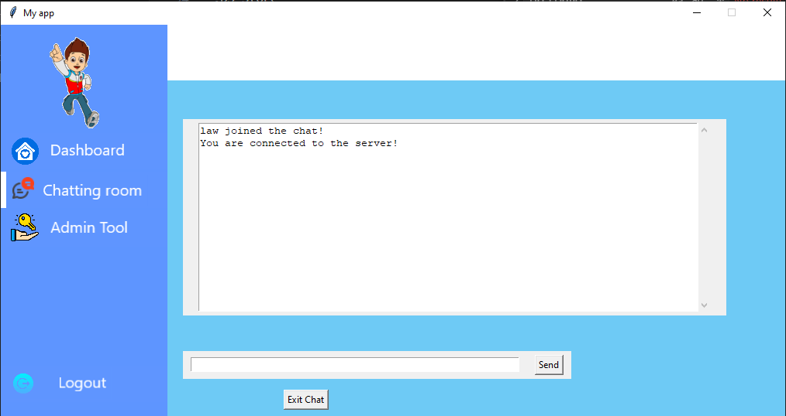
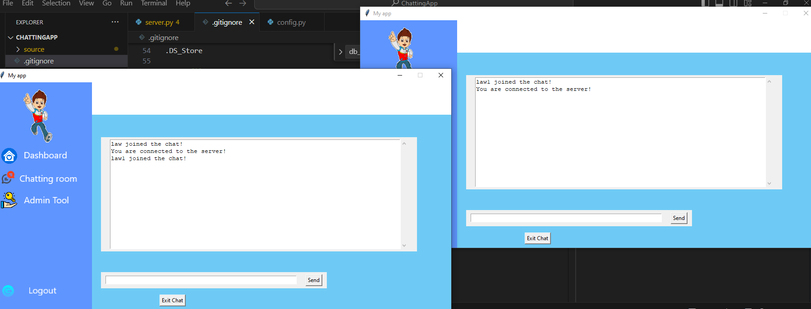

# Funny App

This project includes a graphical user interface with several modules, database management, and TCP server communication.


## Table of Contents

1. [Project Structure](#project-structure)
2. [Installation](#installation)
3. [Usage](#usage)
4. [Modules Overview](#modules-overview)
   - [GUI](#gui)
   - [Services](#services)
   - [Database](#database)
   - [Utilities](#utilities)
5. [Contributing](#contributing)
6. [License](#license)

---

## Project Structure


---

## Installation

1. Clone the repository:
    ```bash
    git clone https://github.com/mrlaw74/Funny-App.git
    cd Funny-App
    ```

2. Install required dependencies:
    ```bash
    pip install -r requirements.txt
    ```

---

## Usage

1. **Database setup:**
    - Import the SQL schema located in `sql/mydb.sql` into your database.

2. **TCP Server:**
    - Start the TCP server:
    ```bash
    python source/services/TCP_Server/server.py
    ```

3. **Run the application:**
    ```bash
    python app.py
    ```
---

## Modules Overview

### GUI

- **Login Module:** Handles user authentication.

- **Main Window:** Centralized dashboard, including chatting room and admin control.

  - **Chatting Room:** Facilitates communication between users in real-time.
  
  
  - **Admin Control:** Manages user permissions, application settings, and administrative tasks.
  - **Applications Section:** A suite of integrated applications available for users to interact with, including:
- **Register:** Handles user registration.


### Services

- **Data_Base:** Manages database connections and operations.
- **TCP_Server:** Manages TCP connections and communication.

### Database

- The `mydb.sql` file contains the schema for initializing the database.
- `db_service.py` provides functions for interacting with the database.

### Utilities

- **checkvalid.py:** Utility for validating user inputs.
- **getIp.py:** Retrieves IP addresses for the application.

---

## Contributing

Contributions are welcome! Please follow the guidelines outlined in `CONTRIBUTING.md`.

---

## License

This project is licensed under the MIT License. See the `LICENSE` file for more information.
